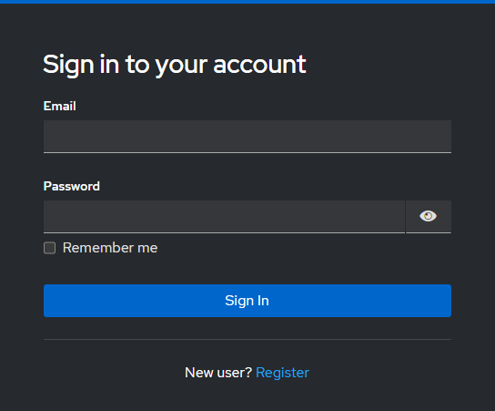
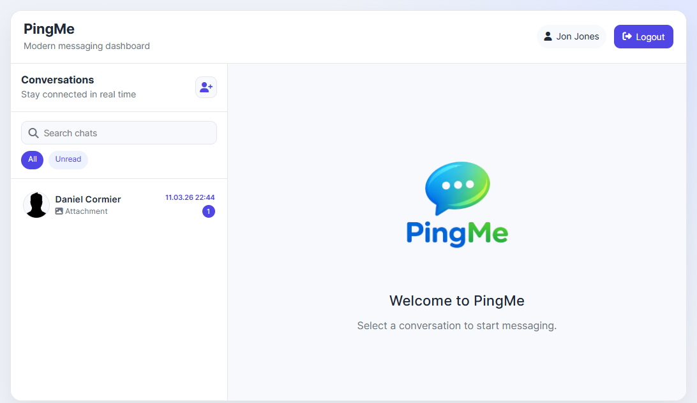
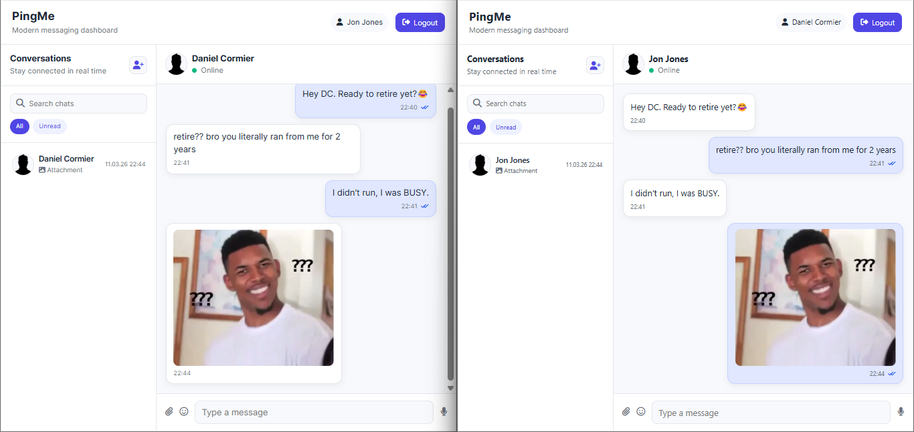
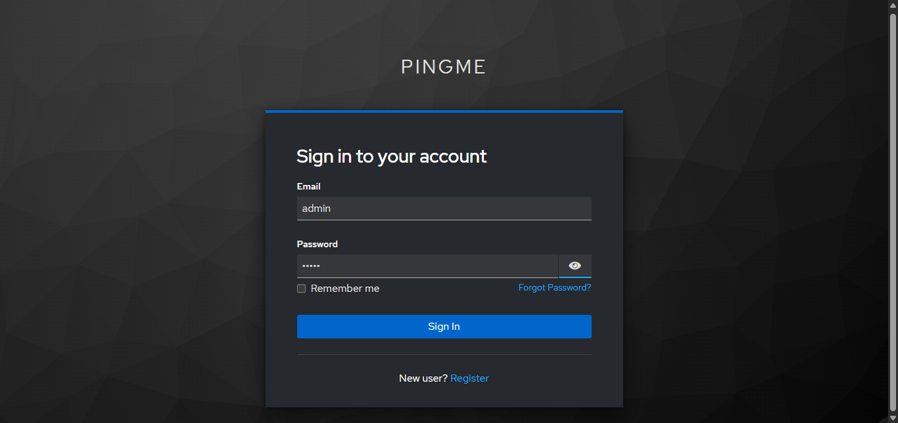

# PingMe - Real-Time Messaging Platform

PingMe is a full-stack portfolio project inspired by modern messaging apps. Authenticated users can discover contacts, create private chats, and exchange text or image messages with live updates powered by WebSockets.

---

## Screenshots

| Login | Chat List | Conversation |
|---|---|---|
|  |  |  |

---

## Features

- ✅ Keycloak authentication (OAuth2 / JWT)
- ✅ Automatic user synchronization from identity provider
- ✅ 1-to-1 private chats
- ✅ Real-time messaging via WebSocket + STOMP
- ✅ Chat list with unread message counts
- ✅ Search and filter conversations (All / Unread)
- ✅ Image message support with zoom preview
- ✅ Message seen/read status
- ✅ REST API docs via Swagger UI

---

## Tech Stack

| Layer | Technologies |
|---|---|
| Frontend | Angular, TypeScript, OpenAPI-generated REST client |
| Backend | Java 21, Spring Boot, Spring Security OAuth2, WebSocket/STOMP, JPA/Hibernate |
| Database | PostgreSQL |
| Identity Provider | Keycloak |
| Infrastructure | Docker, Docker Compose |

---

## Architecture

```
[Angular Frontend]
      │  JWT + REST
      ▼
[Spring Boot Backend] ──── WebSocket/STOMP ────► [Angular Frontend]
      │
      ├──► PostgreSQL (persist users, chats, messages)
      └──► Keycloak    (validate JWT tokens)
```

**Package-by-feature backend structure:**

```text
pingme-backend/src/main/java/.../PingMe/
├── user/          # User entity, sync, controller
├── chat/          # Chat entity, service, controller
├── message/       # Message entity, service, controller, mapper
├── notification/  # WebSocket notification dispatcher
├── security/      # JWT converter, SecurityConfig
├── ws/            # STOMP broker config
├── file/          # File storage + resource serving
├── interceptor/   # User synchronizer filter
└── common/        # Base auditing entity
```

---

## Database Schema

```text
User ──────────────────────────────────┐
│ id (PK)                              │
│ first_name, last_name, email         │
│ last_seen                            │
└──────────────────┬───────────────────┘
                   │ 1:N (sender / recipient)
                   ▼
                 Chat
                 │ id (PK)
                 │ sender_id (FK)
                 │ recipient_id (FK)
                 └──────┬──────────────
                        │ 1:N
                        ▼
                     Message
                     │ id (PK)
                     │ chat_id (FK)
                     │ sender_id, receiver_id
                     │ content, state, type
                     │ media_file_path (nullable)
                     └ created_date, last_modified_date
```

---

## API Reference

| Method | Endpoint | Description |
|---|---|---|
| `GET` | `/api/v1/users` | List all users except authenticated user |
| `POST` | `/api/v1/chats?sender-id={id}&receiver-id={id}` | Create or retrieve existing chat |
| `GET` | `/api/v1/chats` | Get all chats for authenticated user |
| `POST` | `/api/v1/messages` | Send a text message |
| `GET` | `/api/v1/messages/chat/{chat-id}` | Get all messages in a chat |
| `PATCH` | `/api/v1/messages?chat-id={id}` | Mark messages as seen |
| `POST` | `/api/v1/messages/upload-media` | Upload and send an image message |

Swagger UI: [`http://localhost:8080/swagger-ui.html`](http://localhost:8080/swagger-ui.html)

### WebSocket

| Property | Value |
|---|---|
| Handshake endpoint | `/ws` (SockJS) |
| Subscribe destination | `/user/chat` |

---

## Getting Started

### Prerequisites

| Tool | Version |
|---|---|
| Java | 21+ |
| Maven | 3.9+ |
| Node.js | LTS |
| Docker + Docker Compose | Latest |

### 1 - Start infrastructure

```bash
docker compose up -d
```

Starts **PostgreSQL** on port `5433` and **Keycloak** on port `8080`.

### 2 - Configure Keycloak

Follow the [Keycloak Setup](#keycloak-setup) section below before running the backend.

### 3 - Configure the backend

Edit `pingme-backend/src/main/resources/application.yml`:

```yaml
spring:
  datasource:
    url: jdbc:postgresql://localhost:5433/pingme
    username: pingme
    password: pingme

  security:
    oauth2:
      resourceserver:
        jwt:
          issuer-uri: http://localhost:8080/realms/pingme

  servlet:
    multipart:
      max-file-size: 50MB
      max-request-size: 50MB

application:
  file:
    uploads:
      media-output-path: ./uploads
```

### 4 - Run the backend

```bash
cd pingme-backend
mvn clean install -DskipTests
mvn spring-boot:run
```

Backend runs on `http://localhost:8088`.

### 5 - Run the frontend

```bash
cd pingme-ui
npm install
npm start
```

Frontend runs on `http://localhost:4200`.

---

## Keycloak Setup

After `docker compose up -d`, complete the following one-time steps to configure Keycloak for PingMe.

### Step 1 - Open the Admin Console

Go to `http://localhost:9090` and log in with the default admin credentials.

> 

### Step 2 - Create a Realm

1. Click the realm dropdown (top-left) → **Create realm**
2. Set **Realm name** to `pingme`
3. Click **Create**

### Step 3 - Create a Client

1. Go to **Clients** → **Create client**
2. Set **Client type** to `OpenID Connect`
3. Set **Client ID** to `pingme-app`
4. Click **Next**

5. Enable **Standard flow**
6. Click **Next** → **Save**

### Step 4 - Configure Redirect URIs and Web Origins

In the client **Settings** tab, set:

| Field               | Value                   |
|---------------------|-------------------------|
| Root URL            | `http://localhost:4200` |
| Home URL            | `http://localhost:4200` |
| Valid redirect URIs | `http://localhost:4200/*`|
| Web origins         | `http://localhost:4200` |

Click **Save**.

### Step 5 - Enable User Registration

Realm settings → **Login** → enable **User registration**, **Remember me**, **Email as username**

### Step 6 - Create Test Users

1. Go to **Users** → **Add user**
2. Fill in **Username**, **Email**, **First name**, **Last name**
3. Click **Create**
4. Go to the **Credentials** tab → set a **Password** → disable **Temporary**
5. Click **Save password**

Repeat for each user you want to test chatting between.

---

## Docker Reference

```bash
# Start all services
docker compose up -d

# Stop services (keeps data)
docker compose stop

# Remove containers
docker compose down

# Remove containers and wipe all data
docker compose down -v
```